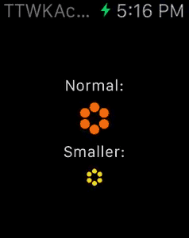

# TTWKActivityIndicator

A drop-in component that simplifies creating of Apple Watch activity animations at run time in both
regular iOS apps and WatchKit extensions. You can customize the color and the size of the bubbles.



It supports both the current style animation and the old one (seen in the betas of the Apple Watch simulator).

## Quick Start

To use with your WatchKit extension:

 - add a WKInterfaceImage into your storyboard exactly where you want the activity indicator to appear (WKInterfaceGroup can be used as well);

 - make sure its Mode is set to 'Center' and Width and Height to 'Size To Fit Content';

 - connect the image with a corresponding property of your subclass of WKInterfaceController;

 - import TTWKActivityIndicator.h;

 - create an instance of `TTWKActivityIndicator` within your awakeWithContext: method, for example:

    ```objective-c
        // This will create it with the default style and size
        TTWKActivityIndicator *indicator = [[TTWKActivityIndicator alloc]
            initWithColor:[UIColor colorWithRed:0.9922 green:0.4549 blue:0.0000 alpha:1.0]
        ];
    ```

 - then transfer it into your image using `setToGroupOrImage:` method:

    ```objective-c
    // Assuming self.activityIndicator is an instance of WKInterfaceImage or WKInterfaceGroup
        [indicator setToGroupOrImage:self.activityIndicator];
    ```

 - done!

You can also check out the example project in `./Example/ActivityIndicator.xcodeproj`, header files have plenty of comments as well.

## Installation

TTWKActivityIndicator is available through [CocoaPods](http://cocoapods.org). To install
it, simply add the following line to your Podfile:

    pod 'TTWKActivityIndicator'

You can also just drop in `/Pod/Classes/TTWKActivityIndicator.*` into your project (along with `/Pod/Classes/TTWKActivityIndicatorView.*` in case you need it a normal iOS app as well).

## Author & License

TTWKActivityIndicator is created by [TouchTribe B.V.](http://www.touchtribe.nl) and is available under the MIT license. See the LICENSE file for more info.
